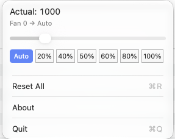

<p align="center">
  
</p>
<h1 align="center">FanControl</h1>

> 🌬️ A macOS menu bar fan controller.

A macOS menu bar app that reads and controls fan speeds via the System Management Controller (SMC).

<p align="center">
  
</p>


## How it works

FanControl talks to the SMC through IOKit to read current fan speeds and minimum/maximum RPM for each fan. You can override the automatic fan curve by setting a fixed speed as a percentage, or reset to let the system take back control. All controls live right in the menu bar dropdown — no window to hunt for.

## Features

- **Fan speeds at a glance** — see current RPM for every fan in the menu bar
- **Slider control** — set fan speed as a percentage per fan via an inline slider
- **Reset All** — return all fans to automatic control with one click

## Requirements

- macOS 14.0+
- SMC-compatible Mac (Intel and Apple Silicon)

## Why is this needed?

macOS manages fans automatically, but sometimes you want more control — for quieter operation under light load, or maximum cooling when pushing the hardware. FanControl gives you that control with minimal friction.

## How to install & run

FanControl is not signed with an Apple Developer ID, because developing free and open-source software doesn't pay for a $99/year Apple Developer Program membership. As a result, macOS may block the app from opening.

1. Download the zip file from the [releases](https://github.com/bexonpak/FanControl/releases/) page.
2. Double-click the app in Finder, then confirm when prompted. ⚠️ Click **Done**
3. Open **System Settings** → **Privacy & Security**, scroll down, and click the **Open Anyway** button.
4. Confirm with your Touch ID or Lock Screen password.

## Building

```bash
xcodebuild -project FanControl.xcodeproj -scheme FanControl build
```

## License

[FanControl](https://github.com/bexonpak/FanControl/) is open source on GitHub under the [GNU General Public License v3.0](LICENSE.txt).
